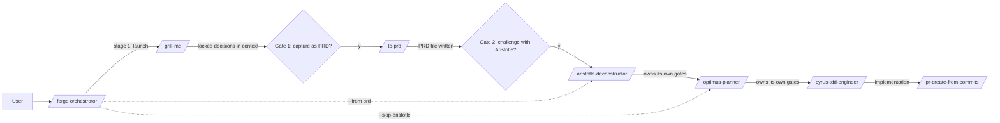

# /forge — Five-Stage Sense-Making + Build Pipeline

The user has a rough idea and wants to take it from "fuzzy thought" to
"built and tested" via a structured five-stage pipeline:

```
grill-me  ->  to-prd  ->  aristotle-deconstructor  ->  optimus-planner  ->  cyrus-tdd-engineer
 (interview)   (capture)    (challenge)              (plan)             (build)
```

`/forge` is a **thin orchestrator**. It owns exactly **two of its own
gates** (after grill-me; after to-prd) and then hands off to
`/aristotle-deconstructor`, which owns the three downstream gates
(Aristotle -> Optimus, Optimus -> Cyrus, plus PR creation downstream of
Cyrus). Each stage consumes the previous stage's artifact verbatim — no
re-interviewing, no work duplication.

---

## Execution modes

This skill supports two execution modes, determined by the caller:

- **`gated`** (default) — every `/forge`-owned stage transition requires
  explicit user approval. Used when invoked directly by the user
  ("Forge, ..." or `/forge`).
- **`autonomous`** — the pipeline still runs to completion (quality is
  non-negotiable), but `/forge`'s two gates auto-approve. The orchestrator
  logs each gate decision instead of blocking. Aristotle/Optimus/Cyrus
  gates are owned by `/aristotle-deconstructor` and follow its mode rules.
  No user-driven autonomous call site exists today; this mode is wired for
  symmetry with other pipeline skills.

When `swarm_mode: true` is also passed, forward it through to
`/aristotle-deconstructor` so downstream skills know to report results
back to the swarm orchestrator rather than presenting interactive menus.

---

## Pipeline overview



---

## Entry points

`/forge` accepts three entry points so the user can skip stages whose
inputs are already available.

### Default: `/forge` (start at grill-me)

For a fuzzy idea with open decisions. Enters at Step 1 (grill-me).

### `/forge --from prd <path>` (skip grill-me + to-prd)

For an idea with an existing PRD or design doc. Path may be absolute or
relative to `~/.claude/tasks/<project>/prds/`. Validates the file exists
and is readable, then jumps to Step 4 (Gate 2 — challenge with Aristotle?)
with the PRD content embedded.

If the path is missing or unreadable, surface the error and stop. Do not
fall back to the default entry — the user explicitly asked to skip the
front end, so silent fallback would be wrong.

### `/forge --skip-aristotle` (PRD straight to Optimus)

For a sound, well-framed PRD that doesn't need first-principles
challenge. Hands the PRD content to `/optimus-planner` directly,
bypassing `/aristotle-deconstructor`. Use only when the framing is
obviously solid — when in doubt, run Aristotle.

This flag is compatible with `--from prd <path>`.

---

## Step 1: Launch grill-me

Extract the user's rough idea from their prompt (strip any "Forge"
prefix, "/forge" prefix, or similar). Launch the `/grill-me` skill via
the Skill tool with the rough idea as the input.

Wait for grill-me to complete its decision-tree traversal. grill-me ends
by summarizing the full set of locked decisions and (per its own SKILL.md)
offering `/to-prd`. Capture the locked decision summary verbatim — it
becomes the handoff payload for Step 3.

**Subagent failure handling:** Follow CLAUDE.md error handling defaults.
If grill-me fails or the user aborts mid-interview, surface the failure
and stop — do not silently proceed to to-prd with a half-resolved tree.

## Step 2: Gate 1 — capture as PRD?

Show the user the locked decision summary from grill-me, then ask:

```
grill-me locked these decisions. What next?

  -> p = Capture as a PRD (/to-prd) — recommended
  -> g = Run grill-me again (more decisions are still open)
  -> x = Stop here (decisions live in conversation, no artifact written)
```

Wait for user input.

**In gated mode:** never skip the gate.

**In autonomous mode:** auto-approve `p` and proceed to Step 3. Log the
decision summary.

## Step 3: Launch to-prd with locked decisions

Inject a synthetic preamble into the conversation context immediately
before invoking `/to-prd`. The preamble must explicitly mark the
decisions as authoritative input, not open questions:

```
## Locked design decisions (from grill-me — DO NOT re-ask)

The following decisions are LOCKED. Synthesize them into the PRD; do not
re-interview the user about them. If the PRD requires additional context
not covered here, surface it as an "Open Question" in the Further Notes
section rather than asking the user.

<verbatim grill-me decision summary>
```

Then invoke `/to-prd` via the Skill tool. `/to-prd` runs its own internal
"Step 2 — Check understanding with the user" gate (per its SKILL.md) —
that gate is `/to-prd`'s contract, not `/forge`'s, so let it run. The
locked-decisions preamble means `/to-prd`'s confirm step should be a
formality (one-keypress confirm), not a re-interview.

Capture the PRD path that `/to-prd` writes. It becomes the handoff
payload for Step 5.

**Risk to monitor:** if `/to-prd` re-asks decisions that are already
locked (despite the preamble), surface that as a blocker — the preamble
mechanism is failing. The fallback is to re-author `/to-prd` to accept an
explicit `locked_decisions` argument. Tracked under obligation
`ob-20260502-001` (`forge-preamble-mechanism-check`), which fires monthly
to prompt a review of recent `/forge` sessions.

## Step 4: Gate 2 — challenge with Aristotle?

Show the user the PRD path written by `/to-prd`, then ask:

```
PRD written. What next?

  -> a = Challenge with Aristotle first (recommended for non-trivial framing)
  -> o = Skip Aristotle, hand straight to Optimus (use only if framing is solid)
  -> x = Stop here (PRD is the deliverable, no implementation)
```

Wait for user input.

**In gated mode:** never skip the gate.

**In autonomous mode:** auto-approve `a` and proceed to Step 5. If
`--skip-aristotle` was set on invocation, auto-approve `o` instead.

## Step 5: Hand off to /aristotle-deconstructor

Launch `/aristotle-deconstructor` via the Skill tool with the PRD content
embedded inline in the launch prompt. The launch prompt must:

1. State that the input is a finalized PRD, not a rough idea — Aristotle
   should deconstruct the framing, not ask the user to re-state it.
2. Include the full PRD content verbatim (or, if the PRD is large, a
   summary plus the path so Aristotle can read it directly).
3. Forward `execution_mode` (`gated` / `autonomous`) and `swarm_mode`
   flags if present.

**Instruct `/aristotle-deconstructor` explicitly:** "This PRD is the
authoritative brief. Do not ask the user to re-state the problem.
Deconstruct the framing for inherited assumptions; recommend the
highest-leverage move; then proceed under your own gate rules."

Once `/aristotle-deconstructor` is invoked, the inner pipeline (Aristotle
-> Optimus -> Cyrus) runs to completion under its own gates. `/forge`
does not gate again — the downstream gates are owned downstream.

## Step 5b: Hand off to /optimus-planner (alternate path)

Used when the user picked `o` at Gate 2, or `--skip-aristotle` was set.

Launch `/optimus-planner` via the Skill tool with the PRD content
embedded inline. The launch prompt must:

1. State that the input is a finalized PRD that the user judged
   sufficiently well-framed to skip Aristotle.
2. Include the full PRD content verbatim.
3. Forward `execution_mode` and `swarm_mode` flags if present.

`/optimus-planner` then runs its own gate flow (plan -> Cyrus). `/forge`
does not gate again.

---

## Gate rules

- **`/forge` owns exactly two gates** in gated mode: Gate 1 (after
  grill-me) and Gate 2 (after to-prd). Aristotle/Optimus/Cyrus gates are
  owned by `/aristotle-deconstructor`. Total user touchpoints across the
  pipeline: at most 5 (Gate 1, to-prd's confirm, Gate 2, Aristotle's
  gate, Optimus's gate). All `/forge`-owned gates are single-keypress.
- **In gated mode: never skip `/forge`'s gates.** Each stage transition
  requires explicit user approval.
- **In autonomous mode: `/forge`'s gates auto-approve.** Log the decision
  and proceed. `/aristotle-deconstructor`'s mode rules apply for the
  downstream gates.
- **PRD-only is valid.** The user may stop after Gate 2 with `x` — the
  written PRD is a useful deliverable on its own.
- **Decisions-only is valid.** The user may stop after Gate 1 with `x` —
  the locked decisions live in conversation; no artifact is written.
- **Each downstream skill runs as a Skill invocation** to keep the main
  context clean and to honor each skill's own boundaries.
- **Enforce boundaries at every handoff.** `/forge` is an orchestrator —
  it does not interview, write PRDs, deconstruct, plan, or implement. If
  a downstream skill bleeds outside its lane, that's a downstream skill's
  bug, not `/forge`'s job to compensate for.

---

## When NOT to use

- **You already have a finalized plan** — use `/optimus-planner` directly
  or `/cyrus-tdd-engineer` if the plan is already written.
- **You only need first-principles analysis** — use
  `/aristotle-deconstructor` directly.
- **You only need an interview** — use `/grill-me` directly.
- **You only need a PRD captured from existing conversation** — use
  `/to-prd` directly.
- **The task is a one-line bug fix or trivial change** — `/forge` is
  heavyweight by design. For small changes, go straight to
  `/cyrus-tdd-engineer`.
- **Context is already large** — `/forge` adds significant context
  through its full pipeline. Consider running `/smart-compact` first or
  starting in a fresh session.

---

## Maintenance

If you discover something during this task that would improve this skill,
propose the change and ask me to confirm before saving it.
